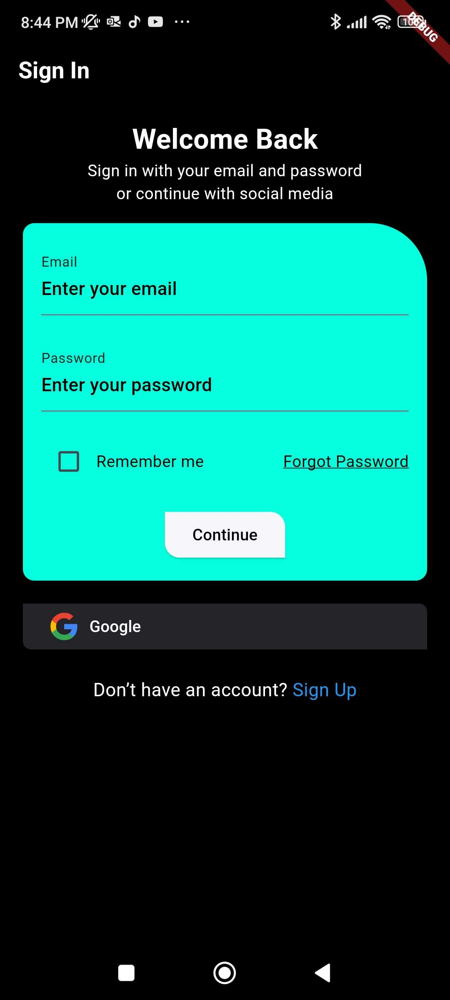
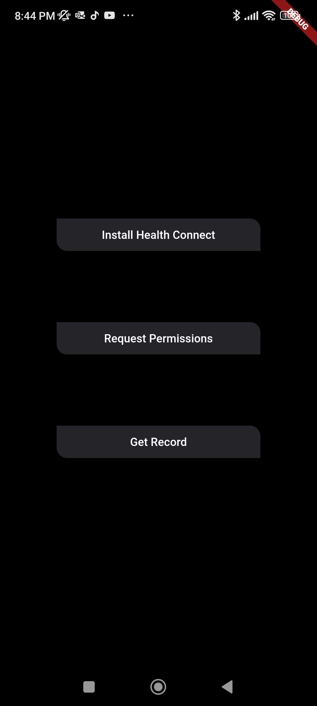
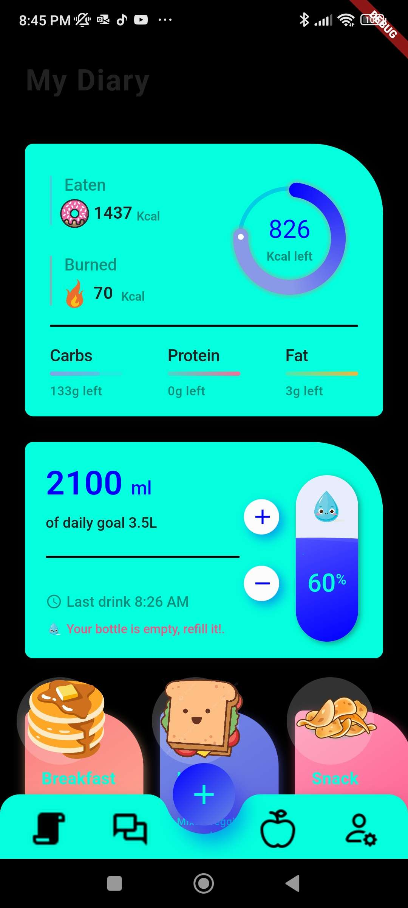
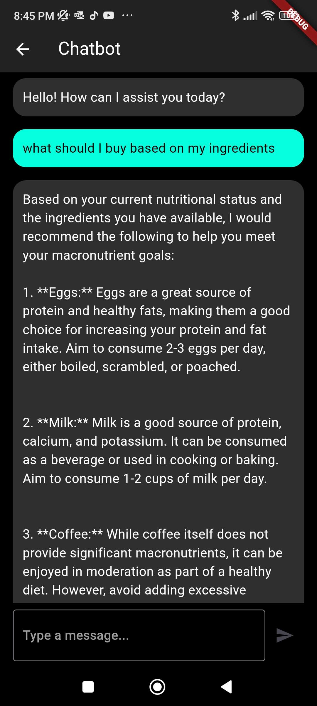
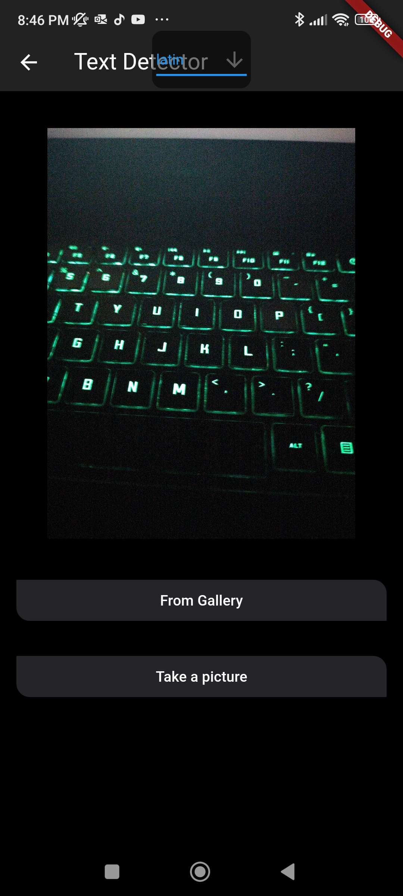
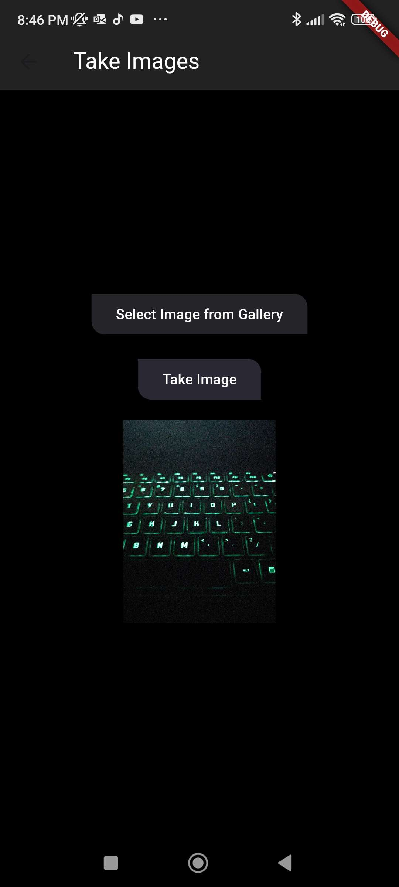
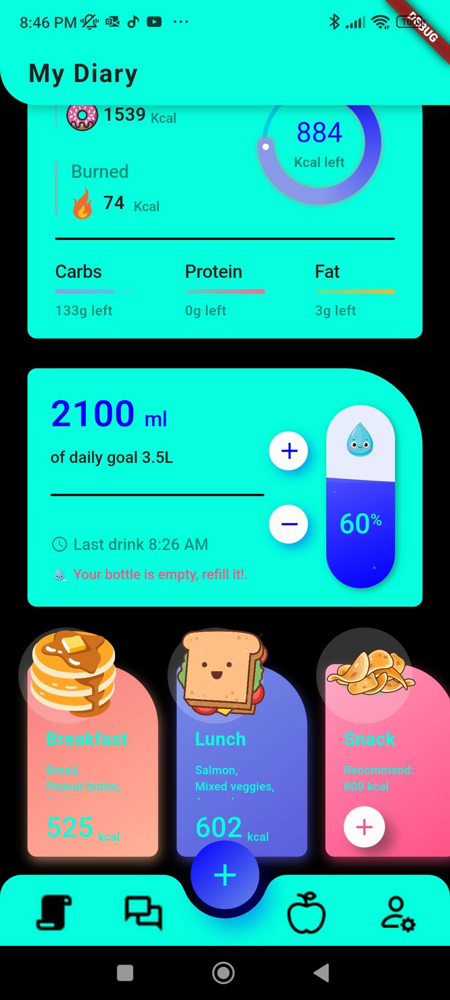
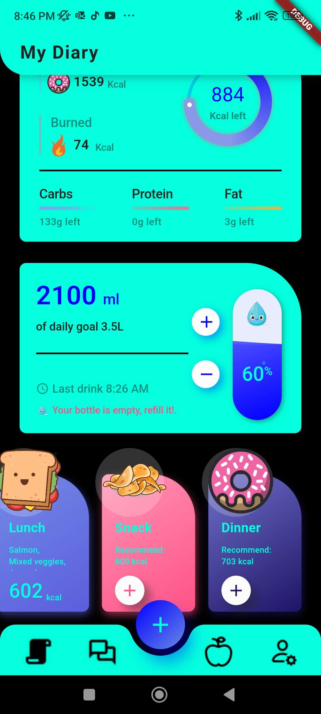

# Nourish Ninja

Nourish Ninja is the first AI powered nutrition app which is your personal nutrition coach and personal dietician!

This was made for GDSC Solution Challenge!!!

Video: https://youtu.be/x2Q5wAbd_ng

## Installation


```bash
flutter create .
```

### Steps to Update Project Configuration

1. Replace `android/app/build.gradle` with `replacement_files/build.gradle`.
2. Replace `android/build.gradle` with `replacement_files/android.gradle`.
3. Replace `android/app/src/main/AndroidManifest.xml` with `replacement_files/AndroidManifest.xml`.
4. Add a ".env" file in the directory of the folder with the following format:


```dart
API_KEY="INSERT_GEMINI_PRO_API_KEY"
SPOONACULAR="INSERT_SPOONACULAR_API_KEY"
```

## Usage

```bash
flutter run
```

While running make sure you have google health connect installed on your device and make sure you request for permissions before clicking "Get Records" to move to the main feature of the app!

Make sure that you press the apple icon to take images of the reciept and click on the plus icon to take the images of the food to add to your database on firebase!

# Technical Architechture

   


## Images!






## Future Plans

### To-Do List

- [ ] Adding Notifications to remind user what to eat throughout the day.
- [ ] Making the DRI calculations more smoother!
- [ ] Fixing some of the bugs present.
- [ ] Adjusting the color scheme for better aesthetics.
- [ ] Moving more processes to the cloud for improved performance.
- [ ] Restructuring file organization for better readability.
- [ ] Add a Timer for foods so they are eaten fresh and don't get wasted!


## Contributing

Pull requests are welcome. For major changes, please open an issue first
to discuss what you would like to change.

Please make sure to update tests as appropriate.
